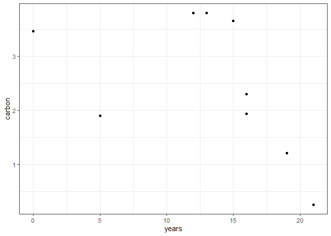

Testing R Markdown
================
Regina OKelley
2024-03-06

This is the first sentence of the document. Below is a test plot with
made up data.

``` r
require(ggplot2)
```

    ## Loading required package: ggplot2

``` r
years <- c( 0,  5, 12, 13, 15, 16, 16, 19, 21)
carbon <- runif(9, min = 0, max = 4)
data <- data.frame(years, carbon)
ggplot(data, aes(x = years, y = carbon))+theme_bw()+geom_point()
```

<!-- -->
